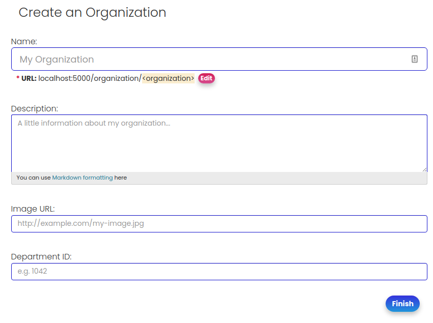
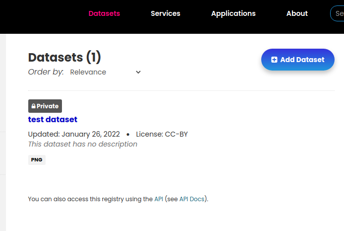
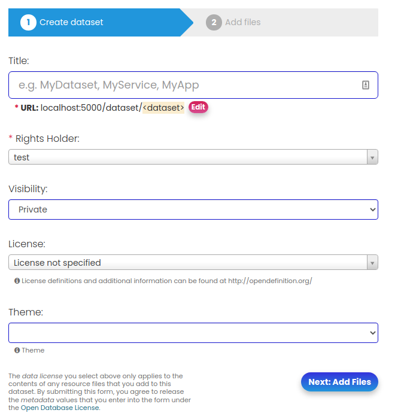
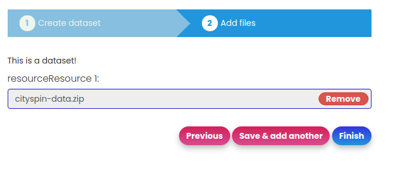
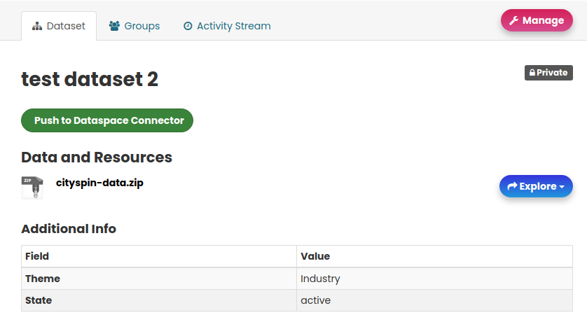
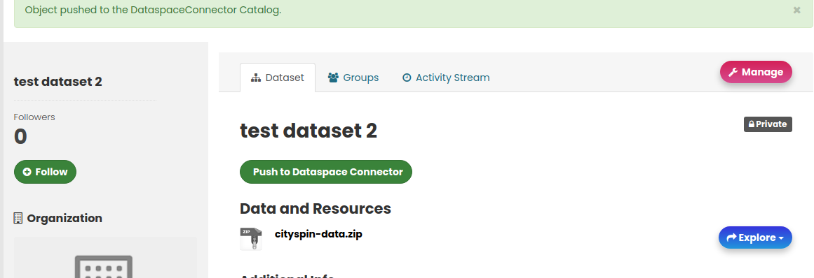
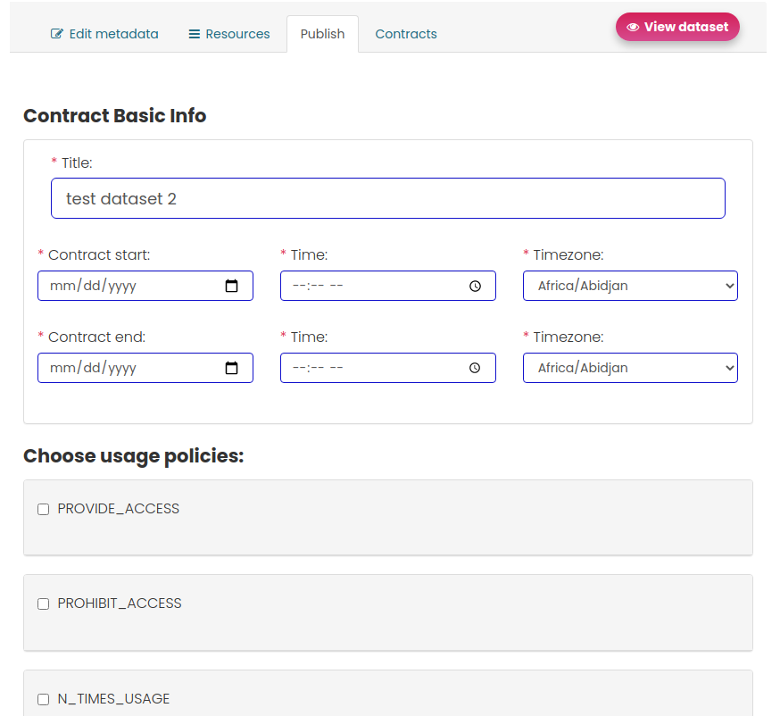

# Initialization

You first need to create an admin account on the CKAN instance.

```
docker exec -it node_ckan_1 ckan -c /etc/ckan/production.ini sysadmin add <username>
```

*replace the value in <> with your preference.

# Log in
CKAN should be up and running. Open your browser and access [localhost:5000](http://localhost:5000).

Provide the credentials of the account that your created on the previous step. If everything is correct you should now be logged in.

# Creating an organization

In order to start creating datasets, services or applications in the UI, you first need to create an organization.
[Organizations](https://docs.ckan.org/en/2.9/maintaining/authorization.html#organizations) are the primary way to control who can see, create and update datasets in CKAN. Each dataset can belong to a single organization, and each organization controls access to its datasets.

Go to [create a new organization](http://localhost:5000/organization/new).



 You should complete at least the title. Titles should be unique. You will get an error in case it exists already. The rest of the fields are optional. You can now click on the "Finish" button to finalize the organization creation process.

# Creating a dataset

In order to create a dataset, service or application, click on the respective element on the top navigation bar.



Then click on the "Add Dataset/Service/Application" button.



Now you get the dataset/application/service creation form. Titles are again unique. You may fill in the rest of the fields. Then click on "Add files" button.

There you should upload the resources. You can either upload a local file, or provide a remote link where the resource exists. Click on "Finish" when you finish uploading.



Your dataset is created and the resources uploaded. But they only exist on CKAN. There are two more steps needed in order to publish them as offers on the Dataspace Connector.

First you need to push the metadata of the asset to the Dataspace Connector.



Click on the "Push to Dataspace Connector" button in order to push the asset to the Dataspace Connector.

If everything was correct, you will get a confirmation.



Now let's create a contract. Click on the "Manage" button. From this menu you can modify the metadata of a package, create or review available contracts and remove the asset completely. Click on the "Publish" tab to create a new contract.



The title, contract start/end dates and at least one policy are required to create a contract. Click on "Publish offering" on the bottom of the page to create the contract. You can see all of the available contracts on the "Contracts" tab. In future through this view, it will be possibe to manage contracts.

The asset is now available and ready to be consumed by a consumer node.
